# Ray Tracer — Taichi

A Python ray tracer built with [Taichi](https://www.taichi-lang.org/) supporting advanced geometry, optical effects, and acceleration structures. Scored **9.5 / 10** on Objective 9 + competition entry.

---

## Features

### Geometry
| Feature | Scene | Points |
|---------|-------|--------|
| **Cone** (quadric) — `intersectCone` in `geometry.py`, parsed in `parser.py` | `Cone.json` | 1.0 |
| **Metaballs** — ray marched implicit surface over a field of implicit spheres | `Metaball.json` | 1.5 |
| **Bezier Surface Patches** — Utah Teapot via `evalpatch` + tessellation | `Teapot.json` | 2.0 |

### Sampling & Optical Effects
| Feature | Scene | Points |
|---------|-------|--------|
| **Mirror Reflection** — `compute_reflection` in `scene.py` | `MirrorBall.json` | 0.5 |
| **Refraction** — `compute_refraction` in `scene.py` | `GlassSphere.json` | 0.5 |
| **Motion Blur** — 3-frame sampling for objects with `motion_dir`; color accumulated proportionally | `Sphere_motion.json` | 0.5 |
| **Spherical Environment Map** — reflected vector mapped to a loaded texture (`cathedral.png`) | `Sphere_env.json` | 1.0 |

### Acceleration
| Feature | Points |
|---------|--------|
| **AABB** bounding box acceleration for large meshes (Bunny, Torus, 3HHB) | 0.5 |
| **Taichi Kernel Caching** — fixed field sizes + separate parameter fields; subsequent renders reuse compiled kernels | 2.0 |

### Competition Entry
Custom scene submitted for the class competition:
- Scene: `scenes/test/261143026_yantianyin_competition.json`
- Output: `out/261143026_yantianyin_competition.png`

---

## Usage

```bash
# Install dependencies
pip install taichi PyQt5 numpy

# Render any scene
python main.py -i scenes/<SceneName>.json -s

# Examples
python main.py -i scenes/Teapot.json -s
python main.py -i scenes/Metaball.json -s
python main.py -i scenes/GlassSphere.json -s
python main.py -i scenes/MirrorBall.json -s
python main.py -i scenes/Cone.json -s
python main.py -i scenes/Sphere_motion.json -s
python main.py -i scenes/Sphere_env.json -s
```

---

## Sample Outputs

**Competition Entry**

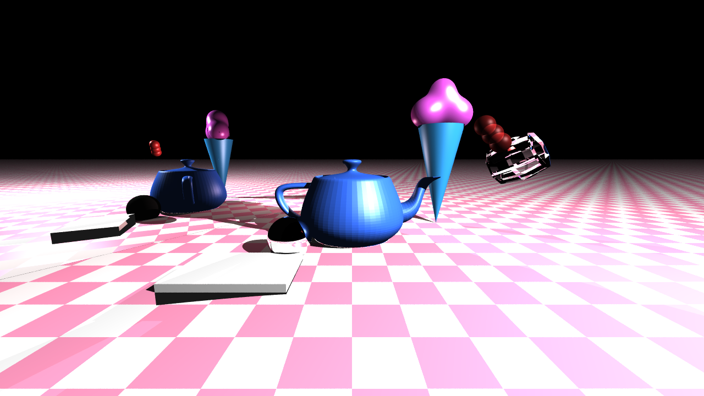

---

**Teapot** (Bezier surface patches)

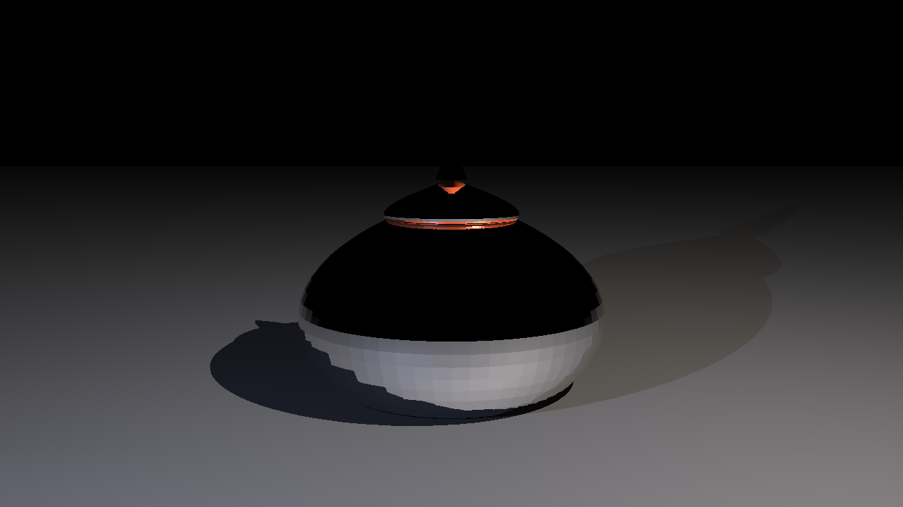

**Metaballs** (ray marched implicits)

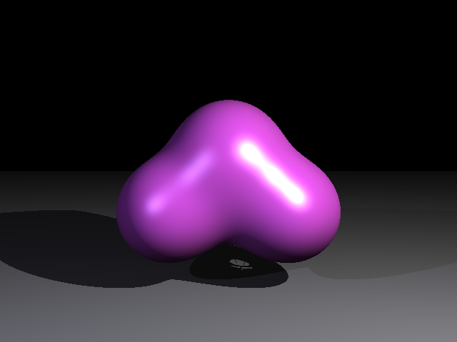

**Mirror Reflection**

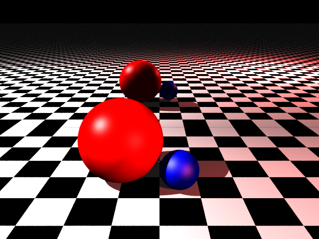

**Glass Sphere** (refraction)

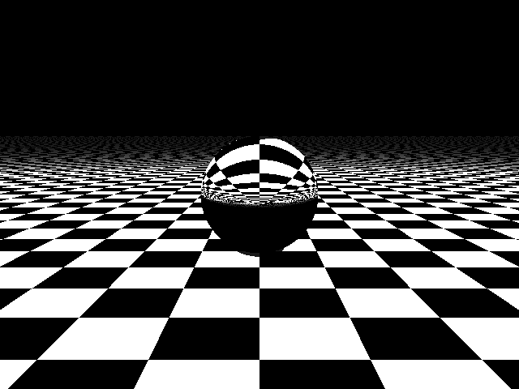

**Motion Blur**

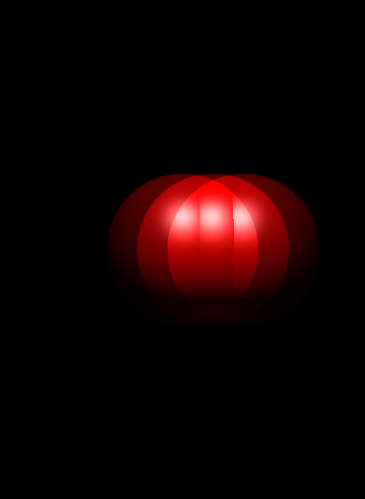

**Spherical Environment Map**

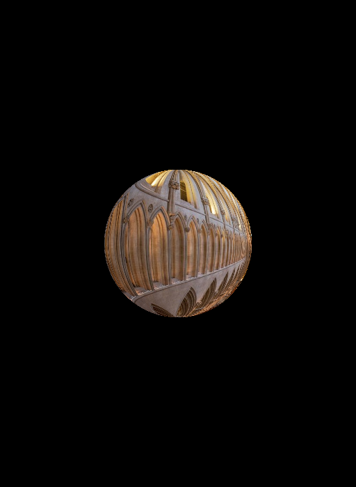

**Cone** (quadric geometry)

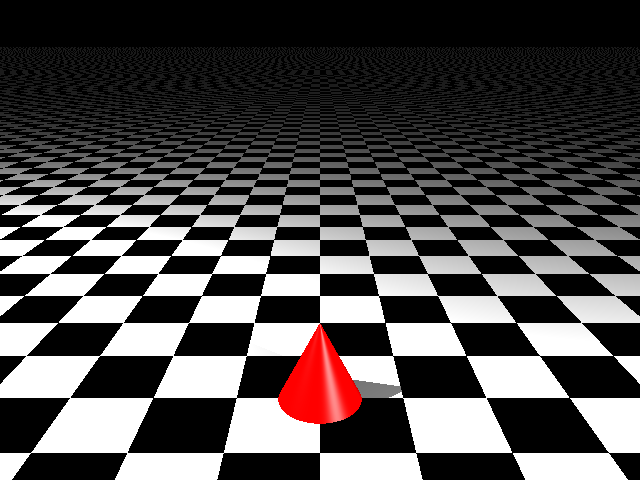

**Bunny Mesh** (with AABB acceleration)

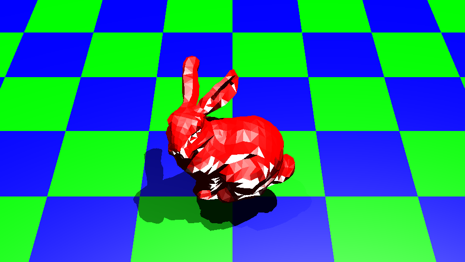

**Torus Mesh**

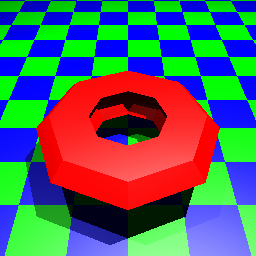

**3HHB Protein**

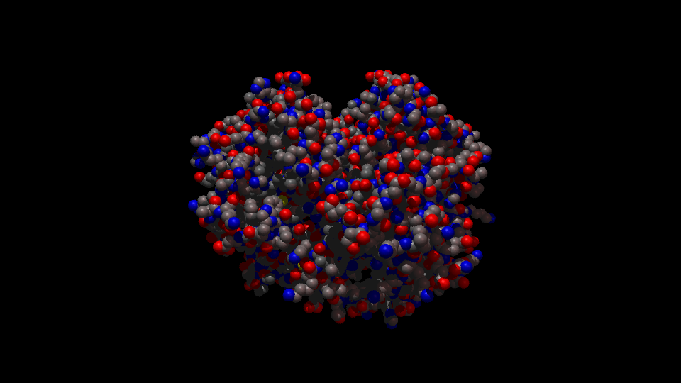

**Box RGB Lights**

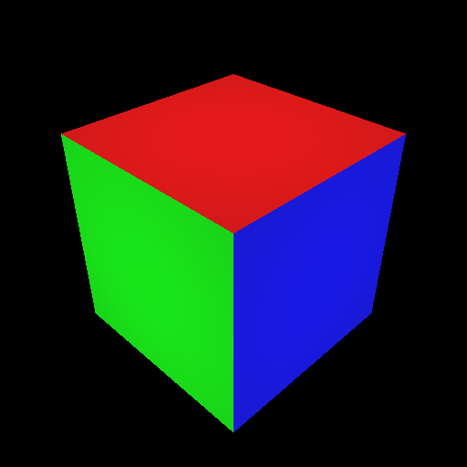

**Ellipse**

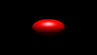

**Two Spheres + Plane**

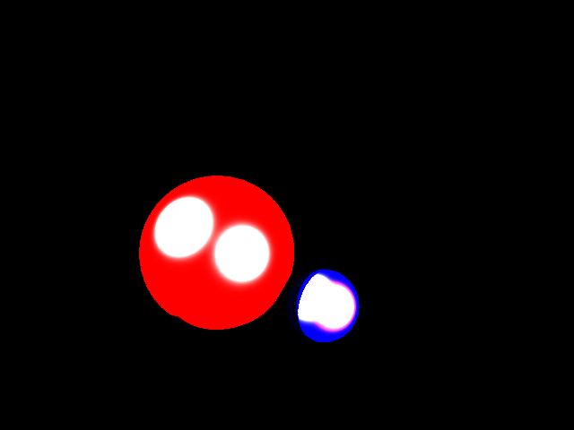

---

## Project Structure

| File | Description |
|------|-------------|
| `main.py` | Entry point and CLI argument parsing |
| `scene.py` | Ray tracing loop, shading, reflection, refraction |
| `geometry.py` | Intersection routines (sphere, cone, mesh, metaballs, Bezier) |
| `parser.py` | JSON scene file parser |
| `camera.py` | Camera model and ray generation |
| `helperclasses.py` | Shared data structures |
| `scenes/` | JSON scene definitions |
| `out/` | Rendered output images |
| `meshes/` | OBJ mesh files (Bunny, Torus, Teapot, 3HHB) |